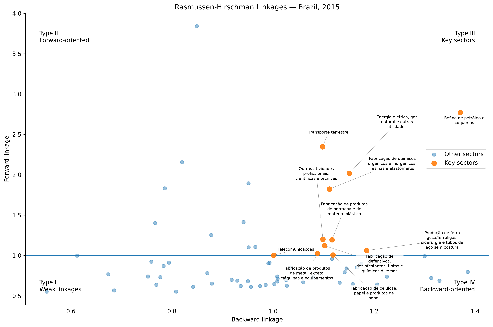
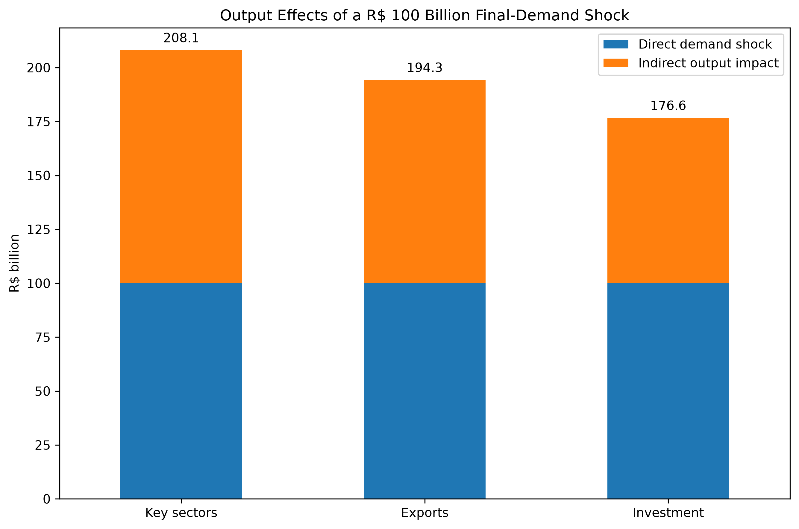
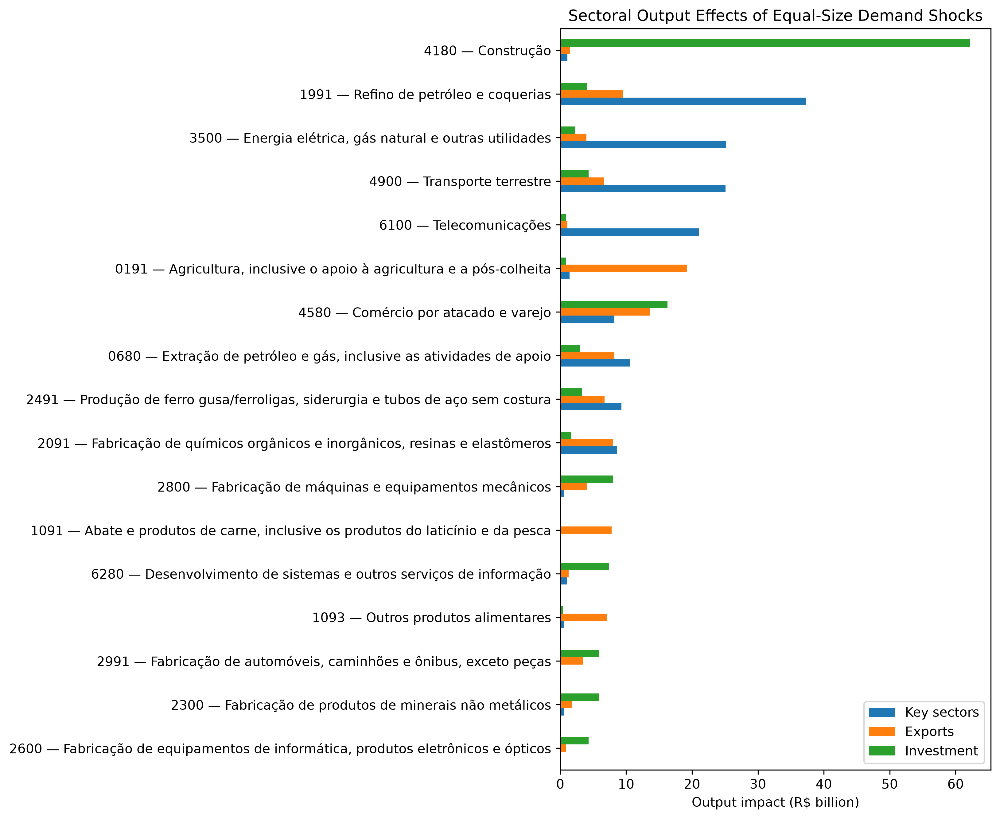

# Brazilian Input-Output Analysis

A reproducible input-output analysis of the Brazilian economy using the
2015 Input-Output Matrix published by IBGE.

The project reconstructs the 67-sector technical coefficient matrix and
Leontief inverse from the official product-by-industry tables, validates
the reconstructed matrices against IBGE's published matrices, identifies
structurally important sectors using Rasmussen-Hirschman linkages, and
runs reusable final-demand shock scenarios.

The analysis is implemented as a tested Python package rather than as a
one-off notebook. A literate analysis script provides the exploratory and
presentation layer.

## What this case demonstrates

This project combines economic modeling with production-style data work:

- automated ingestion of official Excel data;
- semantic parsing of IBGE product and sector codes;
- matrix reconstruction and numerical validation;
- reusable input-output modeling APIs;
- automated tests and reproducible outputs;
- scenario analysis and comparative visualization;
- separation between analytical logic, presentation, and generated data.

## Data

Source: Brazilian Institute of Geography and Statistics (IBGE),
2015 Input-Output Matrix, 67-activity level.

The pipeline uses the official tables to reconstruct:

| Object | Dimensions | Description |
| --- | ---: | --- |
| `Bn` | 127 × 67 | Product-by-activity coefficient matrix |
| `D` | 67 × 127 | Market-share matrix |
| `A` | 67 × 67 | Technical coefficient matrix |
| `L` | 67 × 67 | Leontief inverse |

Final demand is also parsed at the product level and transformed into the
67-sector system using the official market-share structure.

## Matrix reconstruction

The sector-level technical coefficient matrix is reconstructed as

\[
A = D B_n
\]

and the Leontief inverse as

\[
L = (I-A)^{-1}.
\]

The reconstructed matrices are then compared directly with the official
IBGE matrices.

The numerical discrepancies are effectively at machine precision:

| Matrix | Maximum absolute error | RMSE |
| --- | ---: | ---: |
| Technical coefficients `A` | 5.55 × 10⁻¹⁷ | 1.90 × 10⁻¹⁸ |
| Leontief inverse `L` | 2.22 × 10⁻¹⁵ | 6.61 × 10⁻¹⁷ |

This provides an independent validation of the parsing and reconstruction
pipeline before any structural or scenario analysis is performed.

## Structural linkages

Rasmussen-Hirschman indices are calculated from the Leontief inverse.

Backward linkages measure the relative strength of a sector's demand for
inputs from the rest of the economy. Forward linkages measure how strongly
a sector supplies production requirements throughout the system.

The 67 activities are classified into four groups:

| Type | Forward linkage | Backward linkage | Sectors |
| --- | ---: | ---: | ---: |
| I — Weak linkages | < 1 | < 1 | 23 |
| II — Forward-oriented | ≥ 1 | < 1 | 9 |
| III — Key sectors | ≥ 1 | ≥ 1 | 11 |
| IV — Backward-oriented | < 1 | ≥ 1 | 24 |



The 11 key sectors include petroleum refining, electricity and utilities,
land transport, chemicals, basic metals, metal products, pulp and paper,
rubber and plastics, telecommunications, and professional and technical
activities.

## Final-demand shock engine

The project implements a general final-demand shock API based on

\[
\Delta x = L \Delta y,
\]

where `Δy` is an arbitrary exogenous change in final demand and `Δx` is
the resulting total change in gross output.

The implementation separates scenario construction from the economic
model itself. Shocks can therefore represent individual sectors, groups
of sectors, percentage changes in observed final-demand components, or
arbitrary externally supplied demand vectors.

For each scenario, the engine reports:

- direct final-demand shock;
- total output effect;
- indirect interindustry effect;
- aggregate output multiplier;
- sector-level distribution of the resulting output effect.

## Equal-size scenario experiment

Three demand compositions were compared after rescaling each one to the
same R$ 100 billion initial increase in final demand.

| Scenario composition | Direct shock | Total output | Indirect effect | Output multiplier |
| --- | ---: | ---: | ---: | ---: |
| Key sectors | R$ 100.0 bn | R$ 208.1 bn | R$ 108.1 bn | 2.081 |
| Exports | R$ 100.0 bn | R$ 194.3 bn | R$ 94.3 bn | 1.943 |
| Investment | R$ 100.0 bn | R$ 176.6 bn | R$ 76.6 bn | 1.766 |



Because the initial demand increase is identical in all three cases,
differences in aggregate output arise entirely from the sectoral
composition of the shock within the fixed-coefficient Leontief model.

The key-sector composition produces approximately R$ 31.5 billion more
gross output than the investment composition for the same R$ 100 billion
initial demand injection.

## Different shocks, different productive signatures

The aggregate multiplier hides substantial differences in which sectors
actually expand.



The key-sector scenario is particularly intensive in petroleum refining,
electricity, land transport, telecommunications, and intermediate
manufacturing.

The export composition places substantially greater weight on agriculture,
trade, petroleum extraction and refining, food processing, chemicals, and
basic metals.

The investment composition is dominated by construction and has relatively
strong effects on machinery, non-metallic minerals, vehicles, electronic
equipment, information services, and trade.

This illustrates why the composition of aggregate demand matters in an
interdependent production system: equal-sized expenditure shocks need not
generate equal amounts or patterns of gross output.

## Reproducibility

Core analytical logic lives in:

```text
src/python/input_output/
├── download.py
├── parse.py
├── matrices.py
├── validation.py
├── linkages.py
├── shocks.py
├── scenarios.py
└── artifacts.py
```

The exploratory and presentation layer is:

```text
notebooks/brazil_input_output_analysis.py
```

Generated structural datasets are stored under:

```text
data/processed/input_output/
```

and scenario outputs under:

```text
reports/input-output/scenarios/
```

The Python test suite currently contains 134 passing tests covering the
input-output package alongside the other portfolio pipelines.

Run the full test suite with:

```bash
uv run pytest
```

Run the literate analysis as a conventional Python script with:

```bash
PYTHONPATH=src/python uv run python notebooks/brazil_input_output_analysis.py
```

The same file uses # %% cells and can also be executed interactively in
editors such as Spyder or VS Code.

## Limitations

This is a comparative-static input-output exercise, not a macroeconomic
forecast or causal estimate.

The standard Leontief framework assumes fixed technical coefficients and
does not model price adjustment, substitution between inputs, productive
capacity constraints, changes in imports, behavioral responses, financing
conditions, or dynamic adjustment.

Consequently, the scenario results should be interpreted as gross-output
requirements implied by the 2015 production structure under the model's
assumptions, rather than as predictions of realized GDP or production.

The 2015 benchmark structure also represents a historical production
network and should not be interpreted as an estimate of the current
Brazilian economy.
