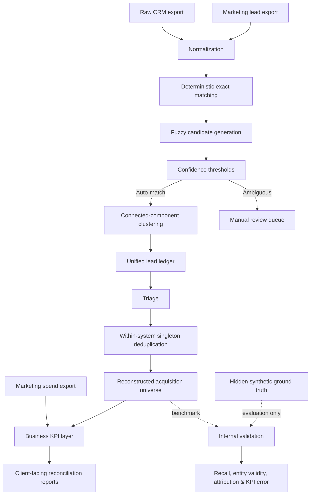
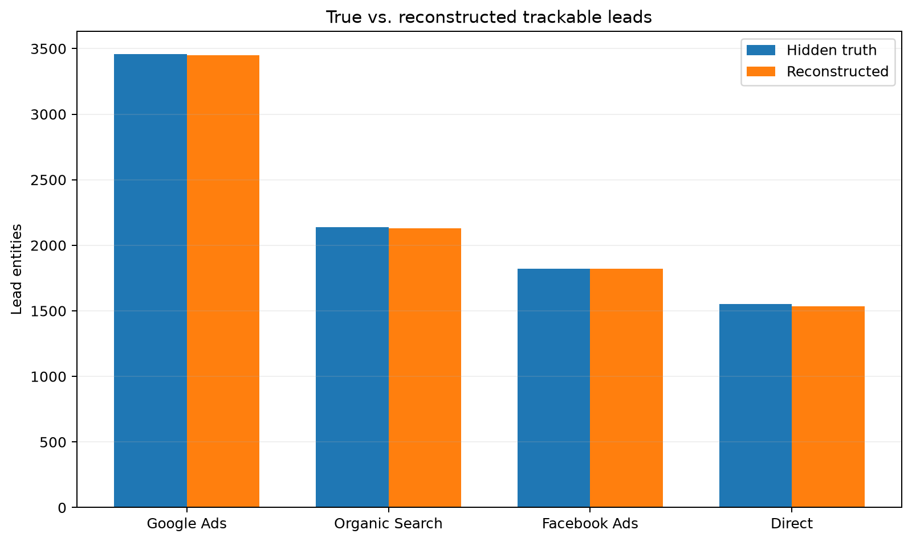
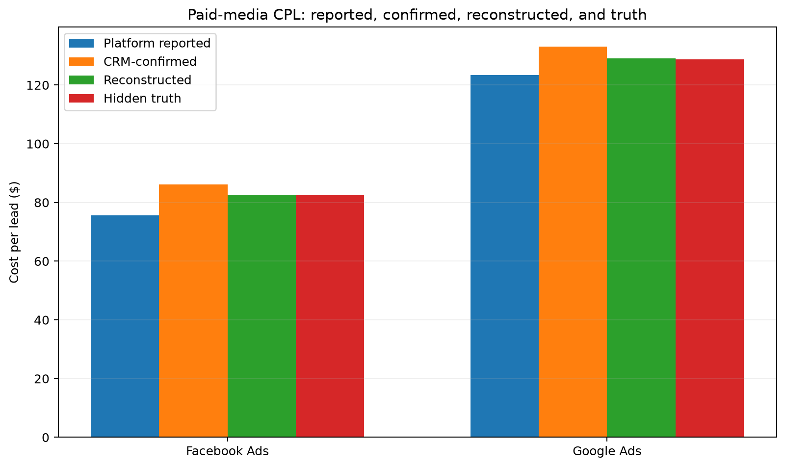
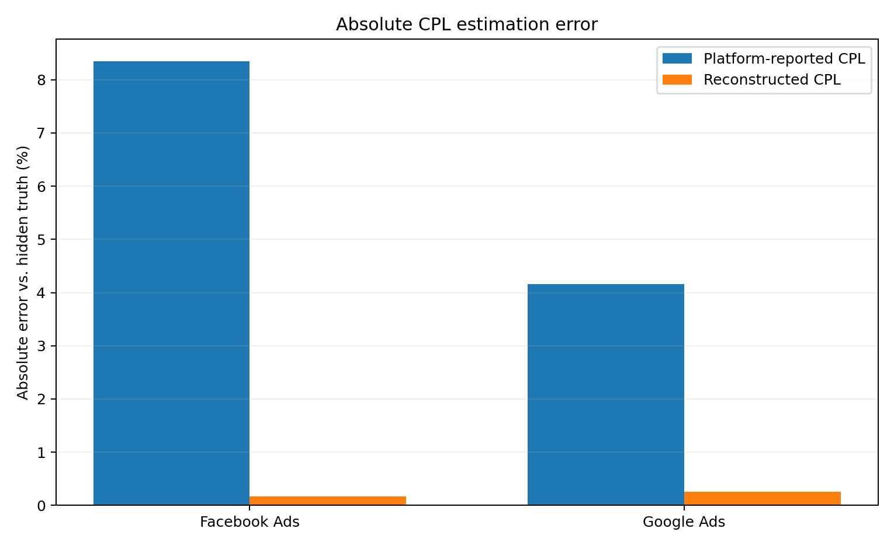
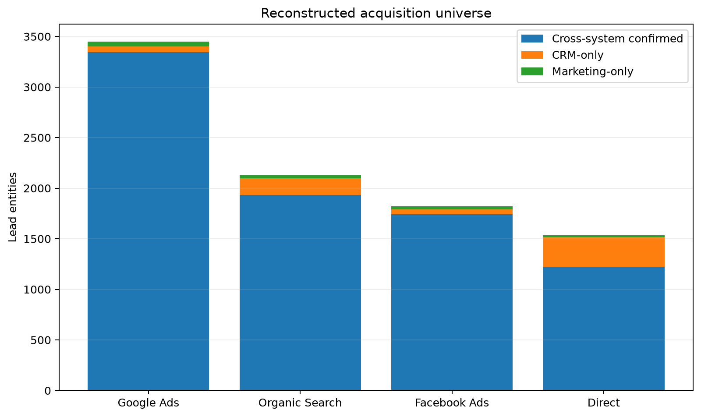

# CRM & Marketing Reconciliation: Reconstructing the Acquisition Funnel

A production-style portfolio case showing how inconsistent records across a CRM, marketing export, and ad-platform reporting can distort lead counts and cost-per-lead (CPL).

The dataset is synthetic but deliberately messy. The reconciliation pipeline operates only on observable exports; hidden ground truth is reserved for post-hoc validation.

## Executive result

The workflow reconstructed **8,932 acquisition entities from 8,972 true trackable leads**, achieving:

- **99.55% lead recall**
- **100% entity validity**
- **100% source-attribution accuracy**
- **0 impure entities**
- **0 fragmented true leads**
- **0 duplicate-entity excess**

For paid media, the reconstructed CPL came within **0.3% of hidden truth**, while platform-reported CPL was off by roughly **4–8%**.

## Why this matters

A dashboard can be numerically correct and still answer the wrong business question.

In this case, the CRM, marketing export, and advertising platforms each represent leads differently. Duplicate submissions, missing records, malformed contact data, tracking loss, test/spam traffic, and source aliases change the denominator used in acquisition KPIs.

The project therefore treats reporting as an **entity-resolution and data-quality problem first**, then recomputes the business metrics.

## Architecture



The dashed validation path is intentionally isolated: hidden truth **never feeds the operational pipeline**.

## Data problems simulated

The synthetic business universe includes:

- inconsistent source aliases;
- missing CRM observations;
- marketing tracking loss;
- duplicate CRM rows;
- duplicate marketing submissions;
- phone formatting noise and malformed phones;
- missing and malformed emails;
- correlated “hard identity” corruption;
- test and spam marketing records;
- recurring customers who can legitimately submit multiple leads;
- platform-reported conversions that do not equal actual lead events.

This makes the task closer to operational data reconciliation than a clean supervised matching exercise.

## Reconciliation workflow

### 1. Deterministic baseline

High-confidence rules use email, phone, name + ZIP, service, and a bounded timestamp window.

The exact matcher achieved **97.24% pair-level recall at 100% precision**. That was deliberately left as a baseline rather than overfitted until every hard case matched.

### 2. Fuzzy recovery

Candidate generation blocks on service and time before applying weighted identity similarity across email, phone, name, and ZIP.

Operational thresholds:

- exact rules -> auto-match;
- fuzzy score >= 0.90 -> auto-match;
- 0.75 <= fuzzy score < 0.90 -> manual review;
- lower scores -> unmatched.

After fuzzy resolution, automatic matching reached **99.89% pair-level recall at 100% precision**. Only 11 candidate pairs required manual review.

### 3. Entity clustering

Accepted record links are edges, not leads. Connected-component clustering converts the bipartite CRM-marketing graph into unique lead entities.

The 8,996 accepted edges became **8,247 cross-system lead entities**, including CRM-side duplicates, marketing-side duplicates, and a small number of many-to-many components.

### 4. Ledger, triage, and within-system deduplication

The unified ledger preserves unmatched observations rather than pretending they do not exist.

Observable triage identified:

- 2,992 CRM-only observations outside marketing-reconciliation scope;
- 590 CRM-only trackable observations;
- 156 CRM-only observations with unknown source;
- 132 apparently valid marketing-only observations;
- 78 likely spam records;
- 49 test records;
- 20 observations involved in manual review.

The eligible unresolved records were then deduplicated within their own systems, collapsing 41 CRM duplicates and 7 marketing duplicates.

### 5. Reconstructed acquisition universe

The final operational denominator combines:

- 8,247 cross-system confirmed entities;
- 560 deduplicated CRM-only trackable entities;
- 125 deduplicated valid marketing-only entities.

**Total: 8,932 reconstructed acquisition entities.**

## Source reconstruction

| Source | Hidden truth | Reconstructed | Error | Recall |
|---|---:|---:|---:|---:|
| Google Ads | 3,458 | 3,449 | -9 | 99.74% |
| Organic Search | 2,139 | 2,128 | -11 | 99.49% |
| Facebook Ads | 1,823 | 1,820 | -3 | 99.84% |
| Direct | 1,552 | 1,535 | -17 | 98.90% |
| **Total** | **8,972** | **8,932** | **-40** | **99.55%** |



## Reported vs. reconciled vs. truth

| Channel | Platform conversions | CRM-confirmed leads | Reconstructed leads | Hidden truth |
|---|---:|---:|---:|---:|
| Facebook Ads | 1,989 | 1,745 | 1,820 | 1,823 |
| Google Ads | 3,608 | 3,345 | 3,449 | 3,458 |

| Channel | Platform CPL | CRM-confirmed CPL | Reconstructed CPL | Hidden true CPL |
|---|---:|---:|---:|---:|
| Facebook Ads | $75.53 | $86.09 | **$82.54** | $82.41 |
| Google Ads | $123.39 | $133.09 | **$129.07** | $128.74 |



The two naive views fail in opposite directions:

- platform reporting is too optimistic because reported conversions overstate the effective acquisition denominator;
- “CRM-confirmed only” is too conservative because a credible lead does not need to appear in both systems to exist.

The reconstructed universe explicitly recovers credible one-system observations after triage and deduplication.

## KPI error reduction

| Channel | Platform CPL error | Reconstructed CPL error |
|---|---:|---:|
| Facebook Ads | -8.35% | **+0.16%** |
| Google Ads | -4.16% | **+0.26%** |



## How the reconstructed universe is composed



This composition is useful operationally because it makes uncertainty visible instead of hiding it inside one headline count.

## Internal benchmark

Hidden synthetic ground truth is used **only here**, after all production-like decisions are complete.

| Validation metric | Result |
|---|---:|
| True trackable leads | 8,972 |
| Reconstructed entities | 8,932 |
| Valid reconstructed entities | 8,932 |
| Unique true leads recovered | 8,932 |
| Unmapped entities | 0 |
| Impure entities | 0 |
| Fragmented true leads | 0 |
| Duplicate-entity excess | 0 |
| Entity validity | 100% |
| Lead recall | 99.5542% |
| Source attribution accuracy | 100% |

The remaining error is omission, not contamination: the model reconstructs slightly fewer leads than exist, but every reconstructed entity maps cleanly to one true lead.

## Deliverables produced by the pipeline

Typical outputs include:

```text
data/processed/reconciliation/
├── reconciliation_results.parquet
├── reconciled_leads.parquet
├── reconciled_record_membership.parquet
├── unified_lead_ledger.parquet
├── triaged_lead_ledger.parquet
├── deduped_singletons.parquet
├── deduped_singleton_membership.parquet
└── reconstructed_acquisition_universe.parquet

reports/reconciliation/
├── reconciliation_summary.csv
├── source_reconciliation.csv
├── campaign_performance.csv
├── unresolved_records.csv
├── reconstructed_sources.csv
├── reconstructed_paid_kpis.csv
└── internal_validation/
    ├── benchmark_summary.csv
    ├── benchmark_summary.json
    ├── source_validation.csv
    ├── paid_kpi_validation.csv
    └── entity_validation.parquet
```

## Testing

The project currently passes **68 pytest tests** covering synthetic-data generation, corruption logic, marketing exports, spend generation, normalization, matching, resolution, clustering, ledger construction, triage, within-system deduplication, acquisition reconstruction, and hidden-ground-truth validation.

```bash
uv run pytest
```

## Skills demonstrated

**Data engineering:** reproducible synthetic data generation, Parquet/CSV pipelines, schema design, modular processing.

**Data quality:** normalization, duplicate detection, missingness, source standardization, noise filtering.

**Record linkage:** deterministic matching, fuzzy similarity, blocking, confidence thresholds, manual-review routing.

**Graph/entity resolution:** connected components over a bipartite observation graph.

**Analytics:** KPI definition, denominator reconstruction, paid-media CPL audit, source-level reconciliation.

**Software engineering:** test coverage, deterministic random seeds, modular Python package structure, explicit separation between production logic and benchmark truth.

## Business takeaway

This case is not primarily about fuzzy matching. It is about recovering a trustworthy business denominator.

The central lesson is simple:

> **Before automating a dashboard, make sure the systems agree on what a lead actually is.**

Once the entity layer is reconstructed, the reporting layer becomes substantially more reliable.
